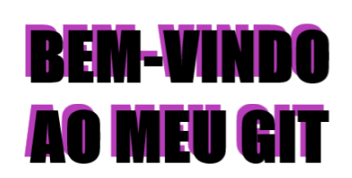

 
  

 
 

  
  

## SOBRE:

- 👩‍💻 Analista de Sistemas na **Construtora Tenda**.
- 👩‍🎓 Formada em Informática para Negócios - FATEC.

## Redes Sociais: :iphone:

    
    

:octocat:~see you
